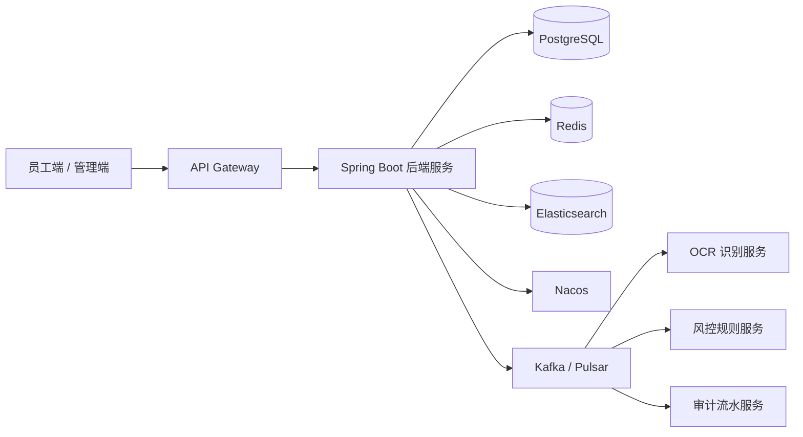

# 出差车票管理系统架构设计

## 目标

系统面向约 100 万注册用户，支持企业员工出差车票的归集、审批、核销、报销对接、风险识别、搜索和审计归档。后端采用 Java + Spring Boot，基础设施使用 PostgreSQL、Redis、Nacos 和 Elasticsearch。

## 技术选型

| 层级 | 方案 | 用途 |
| --- | --- | --- |
| 后端框架 | Spring Boot 3.2 | REST API、业务服务、事务管理 |
| 数据库 | PostgreSQL 16 | 核心交易、审批、审计数据 |
| 缓存 | Redis 7 | 热点详情、列表页、仪表盘摘要 |
| 配置与发现 | Nacos 2.3 | 服务注册发现、集中配置 |
| 搜索 | Elasticsearch 8 | 票号、路线、车次、城市等检索 |
| 数据迁移 | Flyway | 数据库版本管理 |
| 观测 | Actuator + Prometheus | 健康检查、指标、告警 |

## 容量假设

| 指标 | 估算 |
| --- | ---: |
| 注册用户 | 1,000,000 |
| 企业/组织 | 10,000 |
| 月活用户 | 300,000 |
| 日活用户 | 80,000 |
| 高峰在线 | 20,000-50,000 |
| 月新增车票 | 3,000,000-8,000,000 |
| API 读取峰值 | 15,000 QPS |
| API 写入峰值 | 2,500 TPS |

## 总体架构

## 服务边界

当前 `backend/` 采用单服务 MVP 起步，并在包结构上保留后续拆分空间：

- `controller`：REST API 入口
- `service`：车票、审批、风控、报表、搜索编排
- `repository`：PostgreSQL JPA Repository 与 Elasticsearch Repository
- `document`：ES 索引文档
- `entity`：交易库实体
- `config`：Redis 缓存等基础配置

后续流量和团队规模上来后，可拆分为车票服务、审批服务、风控服务、报销集成服务和报表服务。

## 数据设计

核心库以 `tenant_id`、`created_at`、`status` 作为主要过滤维度。对于百万用户和每月数百万车票写入，建议：

- 车票主表按月分区，必要时按企业租户哈希分片。
- 热数据保留 12-18 个月，历史数据归档到低成本存储和 OLAP。
- 对票号、员工、路线、审批状态建立组合索引。
- 凭证影像只存对象存储 Key，不把二进制写入数据库。
- 审计表只追加不更新，满足财务追溯。

## Redis 策略

- `ticketDetail`：车票详情。
- `tickets`：列表页短缓存，按租户、状态、页码维度缓存。
- `dashboardSummary`：仪表盘摘要。
- `riskEvents`：风险事件列表。

写入和审批动作会主动清理相关缓存，避免审批状态和报表摘要长时间不一致。

## Elasticsearch 策略

- 索引名：`travel-ticket-v1`
- 文档 ID：`tenantId:ticketId`
- 检索字段：票号、路线、城市、车次、状态、风险等级。
- 当前 MVP 在创建车票和审批变更时同步写索引；生产环境建议升级为 Outbox + 消息队列异步索引。
- 提供 `POST /api/v1/search/tickets/reindex` 支持按租户重建索引。

## Nacos 策略

- 服务名：`travel-ticket-service`
- Data ID：`travel-ticket-service.yaml`
- 本地默认可通过 `NACOS_ENABLED=true` 启用服务发现和配置中心。
- 数据库、Redis、ES、业务阈值和功能开关可放入 Nacos；敏感凭证建议接入密钥管理系统。

## 一致性策略

- 车票创建与主记录入库强一致。
- OCR、风控、报销推送通过消息异步最终一致。
- 审批状态更新使用乐观锁，避免重复审批。
- ERP/财务推送建议使用 Outbox Pattern，保证本地事务和消息投递一致。

## 高并发策略

- 查询侧用 Redis 缓存热点详情、待办数量和报表摘要。
- 列表页使用游标分页，避免深分页。
- 导出任务异步化，生成文件后通知用户下载。
- 报表进入 OLAP，不直接扫描交易库。
- 上传凭证走预签名 URL，减少应用服务器带宽压力。
